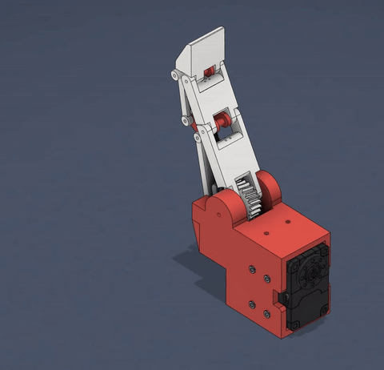
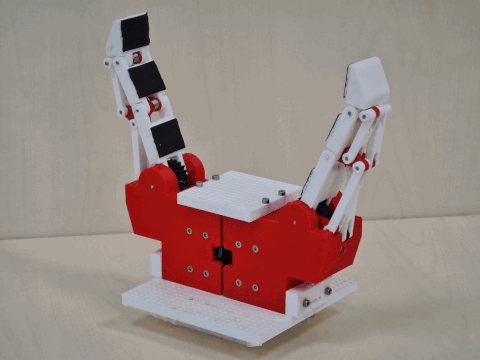

# Multi-fingered gripper

Low-cost open-source 3D-printed reconfigurable multi-fingered gripper. Central to the design is the robotic finger module, which utilizes a single motor. A manual reconfigurable board supports multiple finger configurations, such as two-finger and three-finger setups.

## Under-actuated Finger
The design of the robotic finger was guided by two foundational requirements of our gripper. First, to maintain modularity, each finger was engineered to operate independently, both in terms of hardware and software. Second, in keeping with the objective to minimize costs, our design strategy focused on reducing the number of actuators used. Therefore, we aimed for a configuration with a single motor per finger. This led us to choose an under-actuated design for the fingers. Under-actuation allows for reduced costs while still enabling effective grasping and manipulation capabilities.

## Reconfigurable Gripper
Our gripper is designed to enable manual reconfiguration. Although multi-fingered grippers with active reconfiguration offer faster and automatic adaptability, they are often not appropriate due to high costs and limited reconfiguration options. To merge versatility with cost-effectiveness, our design incorporates a manual reconfiguration mechanism.

## Repository Description

This repository contains 3D models and guides for printing these models, including recommended materials and printer settings. It also includes a detailed list of required hardware and tools, step-by-step instructions for assembly. A control software written in Matlab along with a user manual is included.

### 3D Models and Printing Guides

Detailed descriptions of each 3D model available in this project and instructions for printing, including:
- Recommended materials
- Printer settings

### Assembly Instructions w/ the Bill of Materials

A complete list of all necessary materials, tools, and components required to build and run the project. This includes hardware components, motors, and other accessories. Step-by-step guide on how to assemble the components of the project.

### Software and Control

This project uses Matlab for control and automation. Included in this repository are:
- Source code for the control programs
- Manual explaining how to set up and use the software with the hardware

## Getting Started

1. Print the parts -> [3D Models and Printing Guide](3D_models/)
2. Assemble the finger(s) -> [Assembly Instructions](assembly/)
3. Run the Matlab code -> [Software and Control](SW/)

### Open Lincense
TODO
- state the lincense (open, but must cite)
- cite the paper
