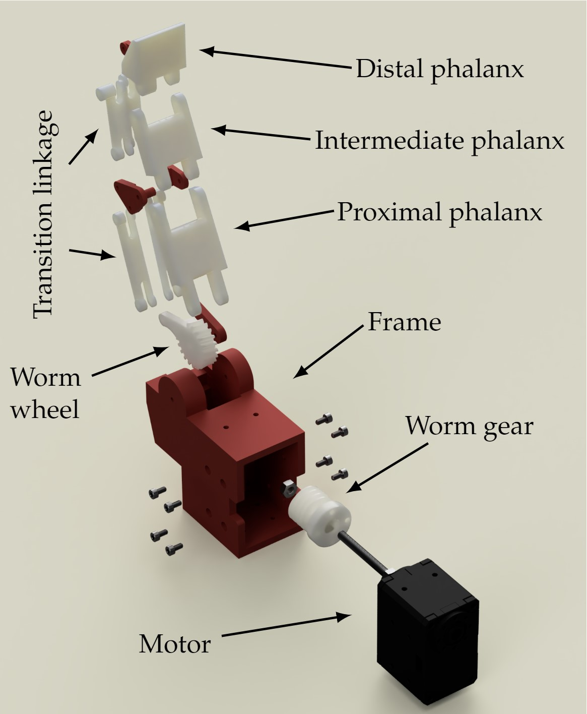
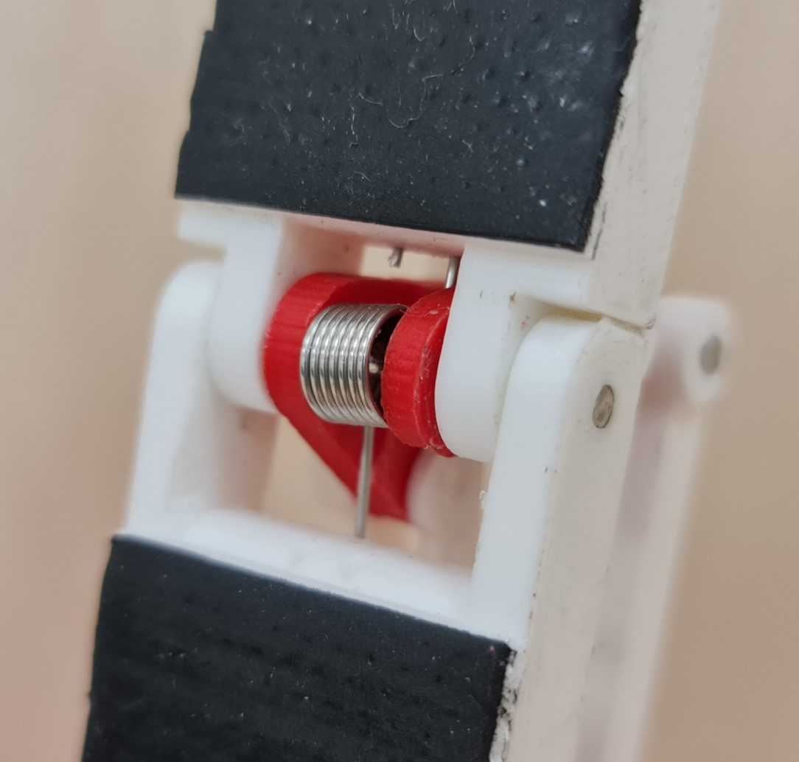
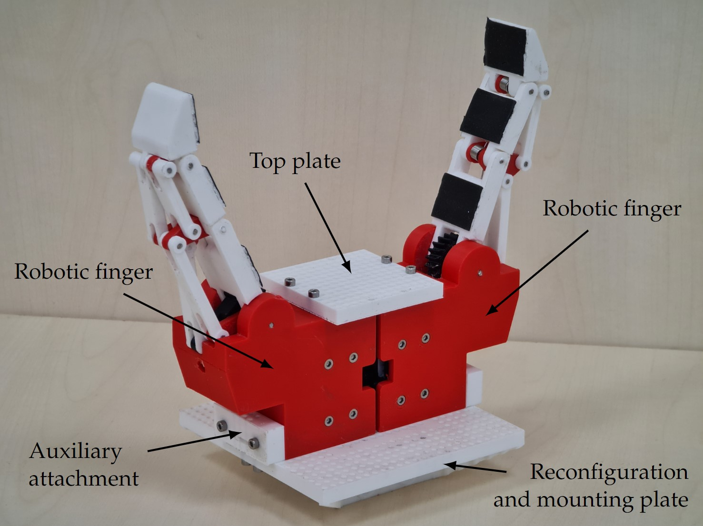

# Assembly Instructions

This section instructions for assembling the robotic fingers and gripper. Follow these steps carefully to ensure correct and efficient assembly of your robotic system.

## Assembly of the Fingers

<figure>

<figcaption> Exploding view of the finger with the main components marked.</figcaption>
</figure>

### 1. Print Components
Begin by 3D printing all parts of the robotic finger (see [3D Models and Printing Guide](3D_models/)).
### 2. Assemble Joints
Connect the printed elements that form each joint using 2 mm diameter stainless steel rods. Cut the rods to the appropriate lengths, align the elements, and insert the rods through them.
### 3. Install Torsion Springs
During the joint assembly, incorporate torsion springs. Insert each end of the torsion spring into pre-designed holes in the elements. These springs are essential as they help the finger return to a fully extended position when not in use.

<figure>

<figcaption> Torsion spring installed at the joint.</figcaption>
</figure>

### 4. Attach to Frame
Secure the assembled finger to the frame with a metal rod to form the main joint.
### 5. Motor and Worm Installation
Attach the worm gear to the motor with four screws. Subsequently, place the motor with the attached worm into the frame and secure it using eight M2 screws, each 6 mm in length.
### 6. Enhance Grip Strength
Apply a strip of self-adhesive rubber to each joint of the robotic finger to improve the grip strength.

## Assembly of the Gripper

<figure>

<figcaption> An example configuration with all the parts of the reconfiguration mechanism marked.</figcaption>
</figure>

### 1. Layout Planning
Determine how to arrange the robotic fingers on the distribution plate using 3D models for guidance. Ensure that the selected holes for mounting are not obstructed by the plate’s attachment system to the robotic arm.
### 2. Choose Base and Support Elements
Select an appropriate base for the fingers and any necessary auxiliary support elements.
### 3. Position Fingers
Adjust each robotic finger to its most open state to ensure unobstructed access to the screw openings.
### 4. Wire Motors
Before mounting, connect the motors with wires. Properly organizing the wires at this stage helps to avoid access issues later.
### 5. Mount the Fingers
Securely position and fasten the robotic fingers to the designated spots on the plate using 6 mm Allen bolts.
### 6. Install Auxiliary Elements
If additional support elements are needed for your configuration, attach them at this point.
### 7. Secure the Base 
Finally, place the base over the fingers. From above, attach the base to the robotic fingers and any auxiliary elements using screws.
